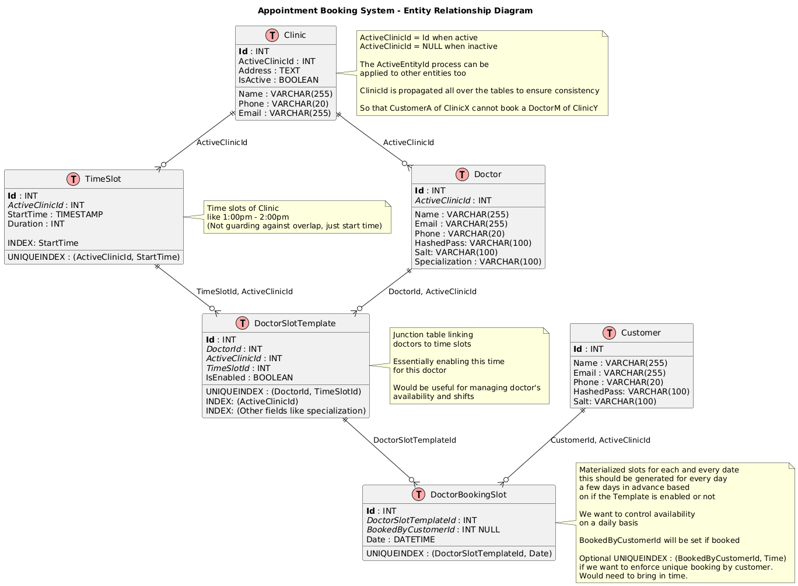

# System Architecture Overview

## Assumptions

1. **Global Customers**: Since customers will come to this platform to search for doctors across multiple clinics, they are assumed to be global entities.

2. **Clinic-Specific Doctors**: Doctors are assumed to be clinic-specific as they register with a clinic. If a doctor wants to register at two clinics, they can have a separate registration at each.

3. **Data Correctness Focus**: Emphasis was put on data correctness. Several considerations were made like ActiveEntityId and propagation of ClinicId for robust foreign keys. Database rules are the last line of defense.

4. **Progressive Design**: The primary design is proposed without the extensibility and scalability questions raised later. Therefore, the initial strategy sections do not discuss topics like sharding, caching, replication, etc. These are brought up in their respective sections.

5. **Single Database Initially**: The system starts with a single database design. Sharding and distributed architectures are introduced as scaling considerations.



## How to think about the db architecture

### Core Entities & Relationships
1. **Doctors, Slots etc** are partitioned by `ClinicId` - each clinic manages their own stuff
2. **TimeSlot** is like a "shift" or unit of time defined by each clinic
3. **DoctorSlotTemplate** represents a doctor's default availability for a time slot (optional - not all doctors work all shifts/slots)

### The Booking System
4. **DoctorBookingSlot** is the actual materialized availability for each day. This is unique per doctor, time slot, and date. It gets generated on schedule (like Thursday night for next week) and can be removed to handle sudden availability changes.

   *Alternative approach: Generate on-demand when booking is requested, but we prefer pre-generation since absence = "not available" is a valid state, and we don't want to book on those*

### Global Identity (Future Consideration)
5. If we need truly global human entities, we can add a `Human` table with `HumanId` linking to `Doctor` and `Customer`. This would store global IDs like NID, Passport, or other KYC info.
6. We could also add `Employee` (N:1→ Human) for service administrators.

### Disabled Entity Pattern
7. **Active VS Inactive Clinic**: This is a pattern for putting entities in an invalid state. We use a calculated column that's the primary key when valid, but null/negative when invalid. This lets us restrict foreign key usage - like forcing removal/disabling of doctors/slots from inactive clinics. This pattern can extend to other entities too, only clinic was done here as an example.

## High-Level Architecture
```
┌─────────────────────────────────────────────────────────────┐
│                    API Layer (REST)                         │
├─────────────────────────────────────────────────────────────┤
│  • Clinic Controller    • Doctor Controller                 │
│  • Booking Controller   • Customer Controller               │
│  • Availability Controller                                  │
├─────────────────────────────────────────────────────────────┤
│                  Service Layer                              │
├─────────────────────────────────────────────────────────────┤
│  • Clinic Service       • Doctor Service                    │
│  • Booking Service      • Customer Service                  │
│  • Availability Service                                     │
├─────────────────────────────────────────────────────────────┤
│                    Core Layer                               │
├─────────────────────────────────────────────────────────────┤
│  • Entities             • DTOs                              │
│  • Service Interfaces                                       │
│  • Repository Interfaces                                    │
├─────────────────────────────────────────────────────────────┤
│                Infrastructure Layer                         │
├─────────────────────────────────────────────────────────────┤
│  • Repository Implementations                               │
│  • Database Context                                         │
│  • Migrations                                               │
│  • External Services                                        │
├─────────────────────────────────────────────────────────────┤
│                  Data Layer                                 │
├─────────────────────────────────────────────────────────────┤
│  • Database (PostgreSQL)                                    │
│  • Cache (Redis)                                            │
│  • Background Workers (Hangfire)                            │
└─────────────────────────────────────────────────────────────┘
```

## Booking Flow & Double Booking Prevention

### Booking Operation Flow
```
┌─────────────────┐    ┌─────────────────┐    ┌──────────────────┐
│   Customer      │    │   Booking       │    │  Booking Service │
│   Request       │───>│   Controller    │───>│                  │
└─────────────────┘    └─────────────────┘    └──────────────────┘
                                                       │
                                                       ▼
┌─────────────────┐    ┌─────────────────┐    ┌─────────────────┐
│   Response      │    │   Booking       │    │  Database       │
│   to Customer   │<───│   Controller    │<───│  Transaction    │
└─────────────────┘    └─────────────────┘    └─────────────────┘
```

### Detailed Booking Process
1. Customer selects a doctor and time slot
2. Controller validates request parameters
3. Booking service checks slot availability
4. Booking service updates the doctor's slot with the customer ID
5. Success/failure response to customer

### Double Booking Prevention Mechanisms

#### 1. **Database-Level Constraints**
- **Unique Constraint**: Each `DoctorBookingSlot` can only optionally have one `Customer`
- **Valid Slot**: The unique indices and the propagated clinic id will ensure partitioning by clinic and other duplication
- **Check Constraints**: Prevent overlapping appointments for the same doctor
- **Foreign Key Constraints**: Ensure referential integrity

#### 2. **Application-Level Validation**
- First, make sure the customer actually exists. If not, just bail out.
- Check if the slot is still free. If someone else already grabbed it, let the user know.
- If it's free, mark it as booked for this customer.
- Send back any communication to the customer if needed.
- Respond with result.

## Architecture Layer Descriptions

### **API Layer (REST)**
- Handle HTTP requests and responses
- Validation
- Map to appropriate services
- Handle auth and ACL
- Format responses, map data to DTOs

### **Service Layer**
- Implement business logic
- Handle database transactions
- Communicate with other services
- Ensure data consistency

### **Core Layer**
- Domain models
- DTOs
- Interfaces for service APIs
- Repository interfaces

### **Infrastructure Layer**
- Concrete data access implementations
- Database context
- Migrations
- External services
- Application configuration management

### **Data Layer**
- Database (PostgreSQL)
- High-performance caching for frequently accessed data (Redis)
  - Doctors, Clinics, Customers etc infrequently updated data
- Scheduled tasks with Hangfire:
  - Daily slot generation

## API Endpoints

### Clinic Management
- `GET /clinics` - List all active clinics
- `GET /clinics/{id}` - Get clinic details
- `POST /clinics` - Create new clinic
- `PUT /clinics/{id}` - Update clinic
- `PATCH /clinics/{id}` - Update clinic
- `DELETE /clinics/{id}` - Deactivate clinic

### Doctor Management
- `GET /clinics/{clinicId}/doctors` - List doctors in clinic
- `GET /doctors/{id}` - Get doctor details
- `POST /clinics/{clinicId}/doctors` - Add doctor to clinic
- `PUT /doctors/{id}` - Update doctor
- `PATCH /doctors/{id}` - Update doctor
- `DELETE /doctors/{id}` - Remove doctor

### Customer Management
- `GET /customers` - List all customers
- `GET /customers/{id}` - Get customer details
- `POST /customers` - Register customer
- `PUT /customers/{id}` - Update customer
- `PATCH /customers/{id}` - Update customer
- `DELETE /customers/{id}` - Remove customer

### Time Slot Management
- `GET /clinics/{clinicId}/timeslots` - List time slots for clinic
- `POST /clinics/{clinicId}/timeslots` - Create time slot
- `PUT /timeslots/{id}` - Update time slot
- `DELETE /timeslots/{id}` - Remove time slot

### Doctor Slot Management
- `GET /doctors/{doctorId}/slots` - List doctor's available slots
- `POST /doctors/{doctorId}/slots` - Activate a slot for a doctor
- `PUT /doctors/slots/{id}` - Update doctor slot availability
- `DELETE /doctors/slots/{id}` - Remove a slot from a doctor

### Daily Slot / Booking Management
- `GET /doctors/{doctorId}/bookingSlots` - List doctor's booking slots
- `GET /bookingSlots/{id}` - Get booking slot details
- `POST /bookingSlots` - Manually create new booking slot
- `PUT /bookingSlots/{id}` - Update booking slot
- `DELETE /bookingSlots/{id}` - Manually remove booking slot

### Availability Queries
- `GET /clinics/{clinicId}/availability` - Get available slots for clinic
- `GET /doctors/{doctorId}/availability` - Get doctor's availability
- `GET /availability/search` - Search available slots by date/specialization
- `POST /availability/createBookingSlots` - Manually create booking slots for a time range (will usually be done automatically)

## Scalability & Extensibility

### Data Partitioning by Clinic
Since our data is already organized by clinic, scaling is pretty straightforward when partitioning by clinic:

- **Database Sharding**: We can split each clinic's data into separate database instances when they get too big
- **Clinic-based Routing**: Send API requests to the right database based on which clinic they're for
- **Per Clinic Scaling**: Each clinic can grow without affecting others

### Global DB for Customers
- Since customers can book at any clinic, we keep all customer info in one global database
- Clinic data (bookings, slots, doctors) is still split up by clinic
- When someone books, we check the customer globally first
- Then do the actual booking in the right clinic's database

### Handling High Activity Within Clinic
The point of contention will likely be booking, since most of the other things happen on a schedule.
- **Locks**: We should use a locking mechanism on the booking slot entity.
  We can add something like a LockedBySessionId to the entity.
  All operations will first try to aquire lock first, then proceed only on success.
- **Row Versioning**: We can use row versioning to detect concurrent modifications, and retry/fail the ones that fail the row version check.
- **State Machine With Queues**: We can go for a better defined state machine like architecture or an actor like architecture to ensure all entities are modified in a consistent manner. The event/action queue will ensure the state that is read IS the state that is being modified, dodging around Time of Read VS Time of Update issues.

### Read-Only Replicas & Load Balancing

For handling lots of read requests (like people searching for available slots):
- **Read Replicas**: Set up a few read-only copies of the database for read queries
- **Load Balancer**: Send read requests to whichever replica is least busy
- **Write Operations**: Keep all booking operations on the primary so we don't mess up consistency
- **Cache Layer**: Use Redis to store frequently accessed stuff like clinic/doctor info

### Future Extensibility
We could integrate reminders, video calls, payments as below:
- **SMS/Email reminders**
  - We should probably use an external service for this like Twilio or SendGrid.
  - We can use a backgrund hangfire job for every time slot to send reminders for that slot some configurable time before that slot starts.
  - If we want to control the reminders from causing a thundering herd we should use a queue to start sending earlier so that they are delivered at least on time or earlier.
- **Online consultations**
  - This is also something that we can integrate with a separate service.
  - We could implement this ourselves too. In this case it should likely be a separate standalone service.
  - In either case, we should instantiate a Scheduled call on the First/Third party service when the booking is confirmed to aquire a join link.
  - The join link can be sent to the customer and doctor with the notifications.
  - If there is some use case for storing the call recordings, we'll need blob storage for that.
- **Payment integration**
  (Ah my home turf)
  - We could build an invoice management service for this too.
  - I would build a M:N Invoice <-> Payment tables to track them.
  - One Payment -> Many Invoices use case: Customer makes multiple slot bookings together. We want to only make one payment for all the bookings.
  - One Invoice -> Many Payments use case: Invoice amount can change, additional charges may be added by the doctor or some other service provided by the clinic.
  - Therefore Many to Many when both of those happen.
  - I would also build Customer Credit as refunding is a bigger hassle.
  - Coupons and discounts can be centralized into this service too.
  - As a whole payments are a sensitive area and it should usually be isolated, especially if we directly integrate with banks and need PCI-DSS compliance.
